  <div align="center">
    
  </div>
 
<div align="center">

**Network intelligence tool · C++17 · Linux**

<div align="center">
  
  
  
  


</div>


---


---


## Modules

| # | Module | What it does |
|---|--------|--------------|
| 1 | **Subdomain Scan** | Custom `DnsEngine` on c-ares - multi-channel parallel resolver with `poll()` + automatic `io_uring` on kernel ≥ 5.1, DoH cascade fallback, TTL cache. Two modes: **FAST** (~3 min) and **DEEP** (~1-2hr). Passive recon from 11 sources. WAF fingerprinting - 16 providers (Cloudflare, Akamai, Imperva, F5, AWS WAF…). Tech stack detection language, framework, CMS, CDN per subdomain. Takeover validation - live fingerprint check against 35+ services |
| 2 | **OSINT** | OSINT Intelligence & Identity Graph: Multi-vector Identity Graph (User/Email/Phone) with detect input type, bayes score verification, cross_reference orchestration (Sherlock, Maigret, Holehe, PhoneInfoga), Breach Intelligence. |
| 3 | **Port Scan** | 3-phase adaptive scan: RTT calibration → port sweep with open/closed/filtered tagging → smart protocol-aware banner grab, version extraction, CVE hints |
| 4 | **Traceroute** | Custom ICMP/UDP/TCP_SYN engine: up to 40 hops, 5 probes/hop, 8 parallel TTL levels, RTT/jitter/loss stats, ASN via Team Cymru, MTU detection |
| 5 | **OS Detection** | Weighted port scoring across 23 services (Windows/Linux/BSD/Network) combined with TTL analysis and banner confirmation |
| 6 | **Network Scan** | 2-phase /24 subnet sweep: ICMP + TCP host discovery across all 254 hosts, then parallel port scan of alive hosts with OS fingerprinting |
| 7 | **DNS Lookup** | Parallel queries for A/AAAA/MX/NS/TXT/CNAME/SOA/CAA/SRV + SPF chain expansion, DMARC, DNSSEC detection, AXFR zone transfer attempt |
| 8 | **WHOIS Lookup** | Full WHOIS data for a domain or IP with structured field extraction |
| 9 | **IP Full Intel** | Geolocation, ASN/BGP, reverse DNS, abuse contacts, 4-DNSBL blacklist check, quick port scan, SSL certificate inspection |
| 10 | **Full IP Recon** | Chains geo, DNS lookup, OS detection and port scan into one full run |
| 11 | **Site → IP** | Strips protocol/path from any URL, resolves to IP, runs full intel on it |
| 12 | **Export JSON** | Saves the last scan result to a structured JSON file

---

## Requirements and Installation

- Linux (Kali, Black Arch recommended)
- `g++` with C++17 support
- `curl` `whois` `dig` `traceroute` `openssl` `ping`

                                             
## For Debian / Kali Linux:
```bash
sudo apt update && sudo apt install -y \
    build-essential g++ libssl-dev libcurl4-openssl-dev \
    libc-ares-dev liburing-dev curl whois dnsutils traceroute iputils-ping
```


## For Arch Linux / BlackArch: 
```bash
sudo pacman -Syu --needed base-devel openssl curl c-ares \
    liburing whois bind traceroute iputils
```


## Build & Setup
```bash
git clone https://github.com/fkmrshl/dark-nexus.git

cd dark-nexus

make

sudo ./dark_nexus
```

> `sudo` is required for raw socket operations used by the Traceroute and OS Detection modules.

---


## Legal

For **educational purposes** and **authorized penetration testing only**.  
Do not use against systems you do not own or have explicit written permission to test.  
The author is not responsible for any misuse or damage caused by this tool.

---

## Author

Structure & code architecture by - Marshal

Designed with AI

Bugs & feedback welcome - [t.me/fuckmarshal](https://t.me/fuckmarshal) 
