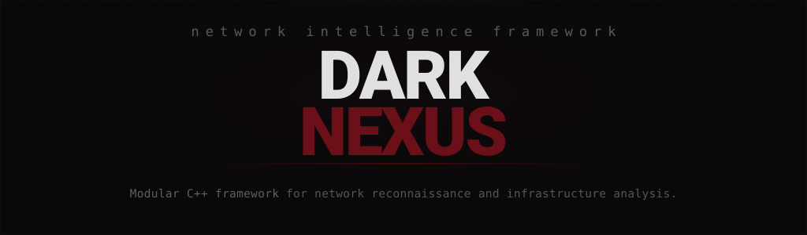

<p align="center">
  
</p>
 
</div>

<br>

**Dark Nexus** - ultimate multi-threaded reconnaissance & pentesting framework written in **C++17**.
  

  
  
  


</div>


---
## Dark Nexus Project:
 
** A modular, multi-threaded C++17 toolkit for network reconnaissance, service analysis, and infrastructure mapping.**

Dark Nexus replaces dozens of disjointed utilities. Written in C++17, it compiles into a single standalone executable that requires no complex environment setup or dependency management. Everything is controlled through an intuitive hybrid CLI, supporting both an interactive menu and direct arguments

Under the hood, it leverages aggressive multi-threading, custom network engines (Raw Sockets, c-ares + io_uring + Thread Pool), and 11 powerful modules: ranging from ultra-fast subdomain scanning with Takeover validation, to in-depth OSINT gathering and heuristic OS fingerprinting.

---
## Preview


---


## Modules

| # | Module | What it does |
|---|--------|--------------|
| 1 | **Subdomain Scan** | Passive recon from 11 sources (crt.sh, VirusTotal, Shodan, Censys…) + async DNS pipeline, DoH fallback, takeover + language detect, permutation engine and JS scraping|
| 2 | **OSINT** | OSINT Intelligence & Identity Graph: Multi-vector Identity Graph (User/Email/Phone) with detect input type, bayes score verification, cross_reference orchestration (Sherlock, Maigret, Holehe, PhoneInfoga), Breach Intelligence. |
| 3 | **Port Scan** |Dual-mode TCP/UDP scanner · raw SYN + connect fallback · T0–T5 timing · TLS/HTTP inspect · CVE hints · OS fingerprint · adaptive IpV4 + IpV6 scan. |
| 4 | **Traceroute** | Multi-protocol path tracer (ICMP / UDP / TCP SYN) with raw socket probes, parallel hop scanning and automatic TCP SYN → connect fallback when CAP_NET_RAW unavailable. |
| 5 | **OS Detection** | Multi-signal fingerprinting via TCP SYN/ACK window analysis, SMB native OS probe, ICMP TTL (init TTL → hop count), HTTP header heuristics and weighted port scoring. |
| 6 | **Network Scan** | 2-phase /24 subnet sweep: ICMP + TCP host discovery across all 254 hosts, then parallel port scan of alive hosts with OS fingerprinting |
| 7 | **DNS Lookup** | Parallel queries for A/AAAA/MX/NS/TXT/CNAME/SOA/CAA/SRV + SPF chain expansion, DMARC, DNSSEC detection, AXFR zone transfer attempt against all NS servers|
| 8 | **WHOIS Lookup** | Full WHOIS data for a domain or IP with structured field extraction |
| 9 | **IP Full Intel** | Full IP profile via ip-api.com geolocation, BGP/ASN lookup via RADB, abuse contacts, 4 DNSBL blacklist checks and quick top-20 port sweep with banners. |
| 10 | **Full IP Recon** | Chains geo, DNS lookup, OS detection and port scan into one full run |
| 11 | **Site → IP** | Strips protocol/path from any URL, resolves to IP, runs full intel on it |
| 12 | **Export JSON** | Saves the last scan result to a structured JSON file

---

## Requirements and Installation

Dark Nexus is heavily automated. You can install it on any Debian, Ubuntu, Kali, Arch, or BlackArch system with a single command. It will automatically detect your OS, install the correct dependencies, build the project with CMake, and configure Linux capabilities so you can run it without sudo.

### Quick Install
```
curl -fsSL https://raw.githubusercontent.com/fkmrshl/dark-nexus/main/install.sh -o /tmp/install.sh && sudo bash /tmp/install.sh
```

### Re-run the install command to update
```
sudo bash install.sh
```

## Usage
Dark Nexus supports both an interactive menu and command-line arguments. It is globally installed to `/usr/local/bin`, so you can run it from anywhere.

**Interactive Mode:**
```
dark-nexus
```

**Command Line Mode:**
```
dark-nexus [options] <target>
```

**Options:**
- `-h, --help`               Show help menu

---


## Legal

For **educational purposes** and **authorized penetration testing only**.  
Do not use against systems you do not own or have explicit written permission to test.  
The author is not responsible for any misuse or damage caused by this tool.

---

## Author
By - Marshal

Bugs & feedback welcome - [t.me/fuckmarshal](https://t.me/fuckmarshal) 
